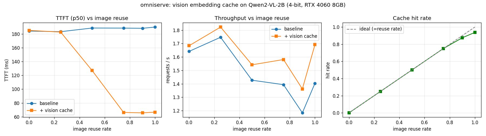

# omniserve

A lightweight **multimodal LLM inference engine** with continuous batching and a
vision-embedding cache, built to run a vision-language model (Qwen2-VL-2B) on a
**single 8 GB consumer GPU** (RTX 4060 Laptop). Inspired by / benchmarked
against SGLang-Omni and vLLM.

> Goal: demonstrate the core serving-engine techniques — iteration-level
> scheduling, KV-cache management, and multimodal-specific optimizations — in a
> small, readable codebase rather than reproducing a production framework.

## Why
Multimodal serving has a cost that text-only serving does not: the vision
encoder (ViT) re-runs for every request, and identical images (multi-turn chat,
repeated system images) get re-encoded needlessly. On a memory-constrained GPU
this wastes both compute and the activation memory budget. omniserve caches
vision-tower outputs by image content so repeated images skip the encoder.

## Architecture
```
  HTTP (OpenAI-compatible)            server.py        [planned]
        │
        ▼
  LLMEngine  ── step loop ──────────  engine.py        ✓
        │
        ▼
  Scheduler  ── continuous batching   scheduler.py     ✓
        │  (admit / decode / retire per iteration)
        ▼
  ModelRunner ─ QwenVLRunner          model_runner.py  (interface ✓, Qwen runner WIP)
        ├─ multimodal preprocessing
        ├─ KV-cache management
        └─ vision embedding cache  ◄── the differentiating optimization
```

## Status
- [x] Request / Sequence data model (`request.py`)
- [x] Continuous-batching scheduler (`scheduler.py`)
- [x] Engine step loop + streaming deltas (`engine.py`)
- [x] Backend interface + `StubRunner` (control plane tested without a GPU)
- [x] 4-bit model load validated on RTX 4060 (peak **2.1 GB** VRAM, see below)
- [x] Vision embedding cache + benchmark harness (real numbers below)
- [x] `QwenVLRunner`: real prefill/decode with per-sequence KV cache — engine
      output is **bit-identical to `model.generate()`**, and concurrent requests
      stay isolated (verified)
- [x] Batched decode: all sequences advance in one forward pass (left-padded KV
      + explicit M-RoPE positions) — token-identical to sequential, **2.6x
      throughput** (see below)
- [x] Benchmark vs. vLLM (same workload, separate processes, true peak VRAM)
- [ ] Batched/chunked prefill
- [ ] OpenAI-compatible server with SSE streaming
- [ ] SGLang in the comparison

## Validated on RTX 4060 Laptop (8 GB)
Qwen2-VL-2B-Instruct, 4-bit NF4:

| metric | value |
|---|---|
| load time | 2.5 s |
| VRAM after load | 1453 MiB |
| **peak VRAM** | **2107 MiB** / 8188 |
| decode speed | 15.3 tok/s |

The ~6 GB of headroom is what makes concurrent continuous batching feasible on
this GPU.

## Result: omniserve vs vLLM
Same multimodal workload (Qwen2-VL-2B, fp16, 24 concurrent requests, 64 tokens
each, greedy), each backend in its own process. Both produce identical output
length (1488 tokens), so the throughput numbers are directly comparable.

| backend | req/s | tok/s | peak VRAM | rel. tok/s |
|---|---|---|---|---|
| vLLM 0.12 | 4.73 | 293.1 | 7034 MiB | 1.00x |
| **omniserve (batched)** | 2.25 | **139.4** | 5028 MiB | **0.48x** |
| omniserve (sequential, Stage 1) | 0.85 | 52.9 | 4528 MiB | 0.18x |

**The interesting part is *why*.** With sequential decode, omniserve's throughput
is flat across load (52 tok/s at 4 requests, 53 at 24) — it cannot exploit
concurrency. vLLM scales ~4x over the same range because it batches the decode
step. Implementing batched decode (one forward for all running sequences, with
left-padded KV and explicit M-RoPE positions) lifted omniserve **2.6x** (53 →
139 tok/s) and closed the gap to vLLM from 5.4x to 2.1x. The remaining gap is
paged attention, fused kernels, and CUDA graphs — none of which omniserve has.
This is an honest accounting of what a production engine buys you, measured
rather than guessed.

Reproduce: `cd benchmarks/compare && python compare.py --requests 24`

## Result: vision embedding cache
Sweeping the image reuse rate on Qwen2-VL-2B (4-bit), baseline vs. cached:



| image reuse | TTFT (p50) | throughput | cache hit rate |
|---|---|---|---|
| 0.00 | 184 → 185 ms (≈0%) | +3% | 0.00 |
| 0.50 | 189 → 127 ms (**−33%**) | +8% | 0.50 |
| 0.75 | 188 → **66 ms** (**−65%**) | +13% | 0.75 |
| 1.00 | 190 → **67 ms** (**−65%**) | +21% | 0.94 |

Key points:
- **At 0% reuse the cache adds no measurable cost** (≈0% change) — it only helps
  when there is something to reuse, with no overhead otherwise.
- TTFT improvement grows with reuse and plateaus at ~65% once the vision encoder
  is fully elided from prefill.
- Cache hit rate tracks the reuse rate exactly, confirming correctness.

Reproduce:
```bash
cd benchmarks
HF_HUB_OFFLINE=1 python bench.py --sweep --requests 16 --out results.csv
python plot.py results.csv          # -> results.png
```

## Quickstart
```bash
conda activate vllm_bench        # torch 2.9 + transformers 4.57
# control-plane demo, no GPU/model needed:
python -c "from omniserve import LLMEngine, Request, StubRunner; \
  e=LLMEngine(StubRunner()); e.add_request(Request(prompt='hi')); print(e.run_until_complete())"
# model sanity check (requires the weights in the HF cache):
python scripts/check_model.py
```

## Layout
- `omniserve/` — the engine package (scheduler, engine, runner, data model)
- `scripts/` — standalone checks (e.g. `check_model.py`)
- `benchmarks/` — workload + benchmark harness (WIP)
